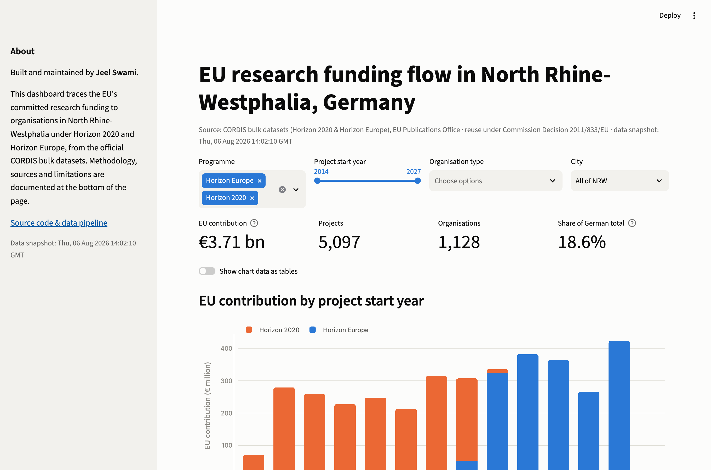
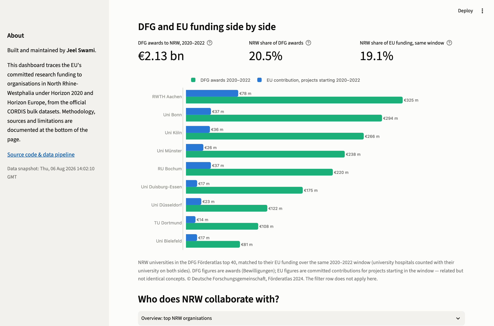
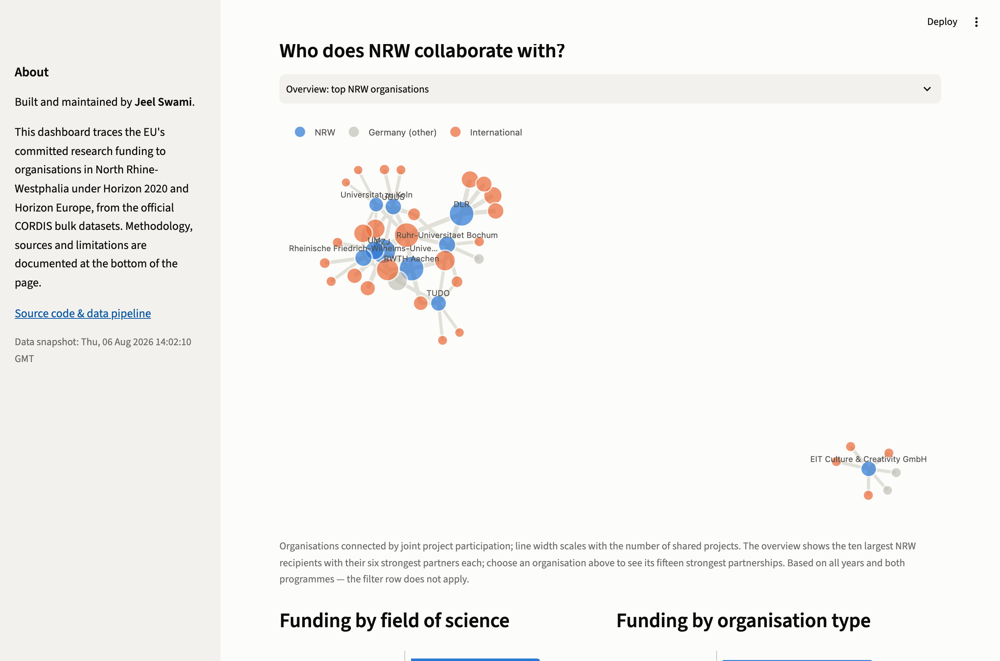

# EU-Forschungsförderung in Nordrhein-Westfalen

[English](README.md) · **Deutsch**

**Live-Demo: [nrw-funding-dashboard.streamlit.app](https://nrw-funding-dashboard.streamlit.app)**

Ein interaktives Dashboard, das jede EU-Forschungsförderung nachzeichnet, die
unter Horizon 2020 (2014–2020) und Horizon Europe (2021–2027) an
Einrichtungen in Nordrhein-Westfalen (NRW) geflossen ist, aufgebaut aus den
offiziellen CORDIS-Datensätzen des Amts für Veröffentlichungen der EU.

Zum Datenstand August 2026 haben die beiden Rahmenprogramme
**3,71 Mrd. €** für **1.128 NRW-Einrichtungen** in **5.097 Projekten**
zugesagt, das sind **18,6 %** der 19,9 Mrd. €, die insgesamt nach
Deutschland gingen. Köln führt die Rangliste an (begünstigt durch den Rechtssitz des
DLR), gefolgt von Bonn, Aachen und Jülich; Natur- und
Ingenieurwissenschaften vereinen zusammen mehr als die Hälfte der nach
Wissenschaftsfeldern zugeordneten Mittel.







## Schnellstart

```
python -m venv .venv && source .venv/bin/activate
pip install -r requirements.txt
python src/fetch_cordis.py      # ~92 MB von cordis.europa.eu
python src/build_dataset.py
streamlit run app.py
```

Das Dashboard bietet Filter nach Programm, Startjahr, Einrichtungstyp und
Stadt, einen durchsuchbaren Projekt-Explorer mit Links zu den
CORDIS-Projektseiten sowie eine optionale Tabellenansicht zu jedem Diagramm.

## Daten und Lizenzen

| Quelle | Abdeckung | Link |
|---|---|---|
| CORDIS – EU-Forschungsprojekte unter Horizon Europe | 2021–2027 | [data.europa.eu](https://data.europa.eu/data/datasets/cordis-eu-research-projects-under-horizon-europe-2021-2027) |
| CORDIS – EU-Forschungsprojekte unter Horizon 2020 | 2014–2020 | [data.europa.eu](https://data.europa.eu/data/datasets/cordish2020projects) |
| Eurostat – Bevölkerung am 1. Januar nach NUTS-Regionen (demo_r_d2jan) | Bevölkerung der Länder | [ec.europa.eu/eurostat](https://ec.europa.eu/eurostat/databrowser/product/view/demo_r_d2jan) |
| DFG-Förderatlas 2024 – Bewilligungen nach Hochschulen und Ländern | DFG-Bewilligungen 2020–2022 | [foerderatlas.dfg.de](https://foerderatlas.dfg.de/daten/) |
| GeoNames – Postleitzahlenregister (DE) | PLZ-Bundesland-Zuordnung, Zentroide | [geonames.org](https://download.geonames.org/export/zip/) |

Die CORDIS-Datensätze werden vom Amt für Veröffentlichungen der EU
publiziert; die Weiterverwendung ist gemäß
[Beschluss 2011/833/EU der Kommission](http://data.europa.eu/eli/dec/2011/833/oj)
mit Quellenangabe gestattet. Eurostat- und GeoNames-Daten werden unter
CC BY 4.0 nachgenutzt. Die DFG-Zahlen sind den veröffentlichten Tabellen
des Förderatlas 2024 der Deutschen Forschungsgemeinschaft entnommen und mit
Quellenangabe wiedergegeben. Die Kartengrundlage nutzt CARTO-Basiskarten
mit OpenStreetMap-Daten; die Attribution erfolgt in der Karte selbst. Der
Quellcode dieses Repositoriums steht unter MIT-Lizenz; die Daten
unterliegen weiterhin den Bedingungen ihrer jeweiligen Anbieter. `src/fetch_cordis.py` protokolliert den Abrufzeitpunkt sowie
die `Last-Modified`-/`ETag`-Header des Servers in
`data/raw/PROVENANCE.json`, sodass jede Zahl auf einen exakten Stand der
Quelle zurückführbar ist.

Ein GitHub-Actions-Workflow ([data-refresh.yml](.github/workflows/data-refresh.yml))
führt die Pipeline am 3. jedes Monats erneut aus und committet den neu
aufgebauten Datensatz nur dann, wenn sich die Quellen tatsächlich geändert
haben; der Push löst automatisch ein erneutes Deployment der Live-App aus.

## Methodik

- **Untersuchungseinheit.** Eine Zeile ist eine *Beteiligung*: die Rolle
  einer Einrichtung in einem Projekt. Eine Einrichtung mit zehn Projekten
  trägt zehn Zeilen bei. Die Kennzahlen aggregieren `ecContribution`, den
  zugesagten EU-Finanzbeitrag an die jeweilige Beteiligte.
- **Länderzuordnung.** Der Eurostat-NUTS-Code jeder Zeile wird gegen die
  Postleitzahl der registrierten Adresse validiert, aufgelöst über das
  [GeoNames-Postleitzahlenregister](https://download.geonames.org/export/zip/)
  (CC BY 4.0). Stimmen beide überein, gilt der NUTS-Code; bei Widerspruch
  gewinnt die Postleitzahl, denn manche CORDIS-Versionen enthalten
  fehlerhafte NUTS-Codes und Geokoordinaten (die Version vom August 2026
  ordnete Einrichtungen aus Köln, Jülich und München Berlin zu). Koordinaten, die
  mehr als ~0,7° vom PLZ-Zentroid abweichen, werden ebenfalls durch das
  Zentroid ersetzt. Zeilen ohne beide Signale fallen auf einen Abgleich des
  Städtenamens zurück; die verwendete Methode wird je Zeile protokolliert,
  und Zeilen ohne verwertbares Signal (<1 %) werden ausgeschlossen. Ein
  Validierungsschritt (`src/validate_build.py`) blockiert zudem jede
  automatische Aktualisierung, deren Summen unplausibel von der vorherigen
  Version abweichen.
- **Wissenschaftsfelder.** EuroSciVoc klassifiziert Projekte, nicht
  Beteiligungen, und ein Projekt trägt meist mehrere Zuordnungen.
  Feldsummen teilen daher den Beitrag jeder Beteiligung gleichmäßig auf die
  obersten Wissenschaftsfelder ihres Projekts auf, sodass sie sich ohne
  Doppelzählung zur Gesamtsumme addieren.
- **DFG-Vergleich.** Die DFG-Zahlen stammen aus den veröffentlichten
  Tabellen des Förderatlas 2024 (© Deutsche Forschungsgemeinschaft) und
  umfassen Bewilligungen 2020–2022; die EU-Seite zählt Zusagen für Projekte
  mit Start im selben Zeitraum. Universitätsklinika werden auf beiden
  Seiten ihrer Universität zugerechnet, rechtlich selbstständige
  An-Institute ausgeschlossen. Bewilligungen und Zusagen sind verwandte,
  aber nicht identische Größen.

### Grenzen der Aussagekraft

- Beiträge sind Zusagen bei Vertragsunterzeichnung, keine endgültigen
  Zahlungen.
- Einrichtungen mit mehreren Standorten werden an der registrierten Adresse
  gezählt, in der Regel dem Rechtssitz. Die rund 660 Mio. € des DLR etwa
  werden Köln zugerechnet, obwohl seine Institute über ganz Deutschland
  verteilt sind.
- Horizon Europe läuft noch; junge Startjahre sind systembedingt
  unvollständig und wachsen mit jeder CORDIS-Version.

## Aufbau des Repositoriums

```
src/fetch_cordis.py       Rohdaten laden, Provenienz protokollieren
src/fetch_population.py   Bevölkerung der Länder über die Eurostat-API
src/fetch_plz.py          PLZ→Bundesland-Register von GeoNames
src/fetch_dfg.py          Tabellen des DFG-Förderatlas 2024 (Datawrapper)
src/build_dataset.py      Filtern, Zuordnen, Verknüpfen; Parquet schreiben
src/validate_build.py     Plausibilitätsprüfung vor automatischen Updates
app.py                    Streamlit-Dashboard
.github/workflows/        monatliche Datenaktualisierung
data/raw/                 CORDIS-Archive + PROVENANCE.json (Archive unversioniert)
data/reference/           Referenzdaten mit Abruf-Metadaten
data/processed/           Parquet-Dateien + generierte Build-Zusammenfassung
```

## Ausblick

- **DFG-Daten auf Projektebene.** Das Dashboard vergleicht DFG- und
  EU-Förderung anhand der veröffentlichten Förderatlas-2024-Tabellen; eine
  Analyse auf Projektebene setzt voraus, dass GEPRIS einen
  maschinenlesbaren Massenzugang anbietet.
